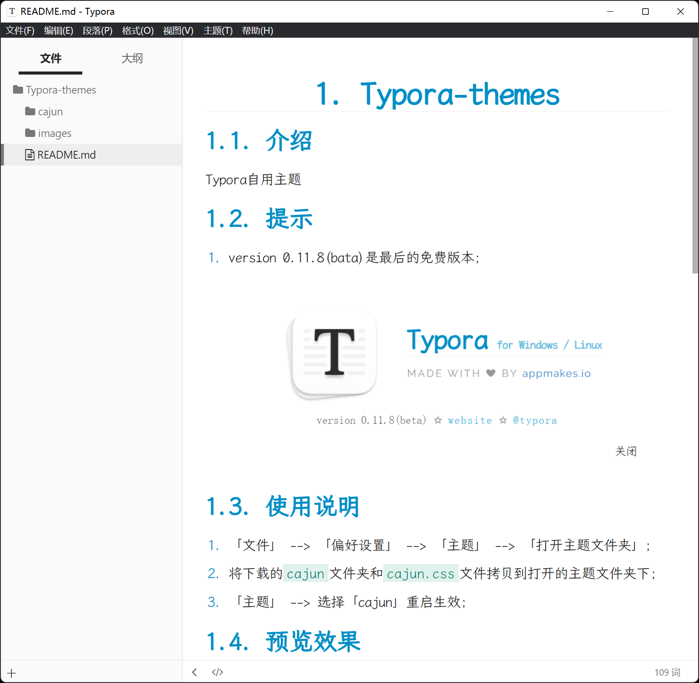

# Typora-themes

## 介绍
Typora自用主题

## 提示

1.  0.11.8(bate)是最后的免费版本；

## 使用说明

1.  「文件」 --> 「偏好设置」 --> 「主题」 --> 「打开主题文件夹」；
2.  将下载的`cajun`文件夹和`cajun.css`文件拷贝到打开的主题文件夹下；
3.  「主题」 --> 选择「cajun」重启生效；

## 预览效果

